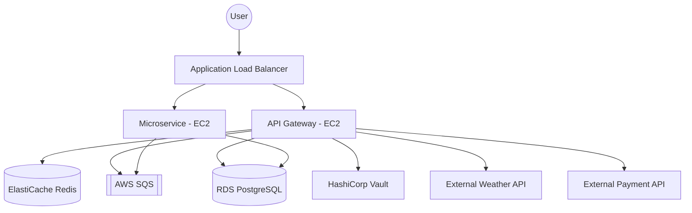

# Architecture Overview

## Component Details

### 1. API Gateway
The primary entry point for all requests. Handles rate limiting, authentication (via Vault), and request aggregation.

### 2. Caching Layer
Redis is used for:
- API response caching (e.g., weather data)
- Session management
- Distributed locking

### 3. Messaging
SQS handles asynchronous tasks such as:
- Sending emails
- Processing payments
- Background data synchronization

### 4. Database
PostgreSQL 16 stores persistent data:
- User profiles
- Transaction history
- System configurations
